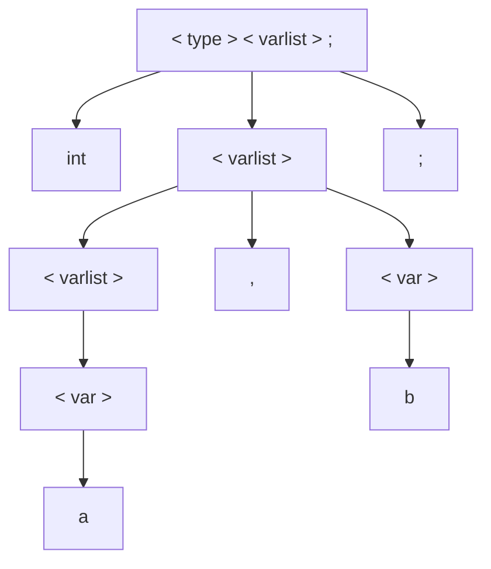
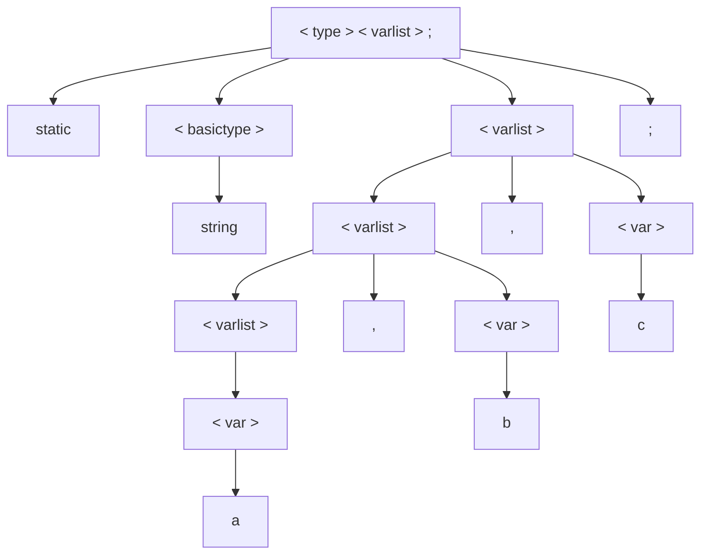
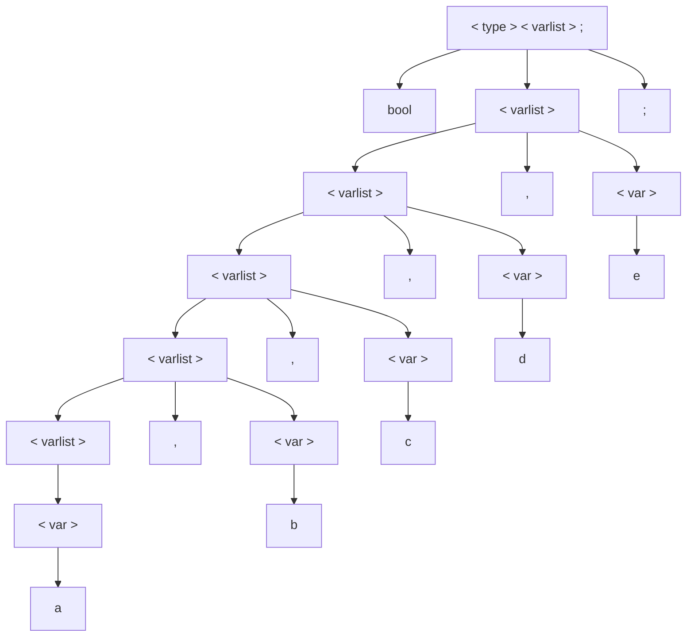

# 1 - Considere a seguinte gramática em notação BNF:
```bnf
<S> ::= <A>a<B>b
<A> ::= <A>b | b
<B> ::= <B> | a
```

Indique quais das seguintes sentenças estão na linguagem gerada por essa gramática. Justifique a sua resposta apresentado a derivação da sentença.

### a) baab
```bnf
<S> ::= <A>a<B>b
    ::= ba<B>b
    ::= baab
```
### b) bbbab
```
Como o símbolo inicial contem um 'a' acompanhado de <B>, e <B> sempre deriva para pelo menos um outro 'a' é impossível representar uma string com apenas um 'a' nessa gramática.
```
### c) bbaaaaaa
```
Como o símbolo inicial termina com um 'b', é impossível representar uma string sem um 'b' como último símbolo final da string nessa gramática.
```
### d) bbaab
```bnf
<S> ::= <A>a<B>b
    ::= <A>ba<B>b
    ::= bba<B>b
    ::= bbaab
```
---

# 2. Considere a seguinte gramática em notação BNF:
```bnf
<tdecl> ::= <type> <varlist> ;
<varlist> ::= <var> | <varlist> , <var>
<var> ::= a | b | c | d | e | f | g
<type> ::= static <basictype> | <basictype>
<basictype> ::= int | bool | string
```
Apresente uma derivação à extrema esquerda e construa a árvore de análise para cada
uma das seguintes sentenças:

### a) int a, b;
```bnf
<tdecl> ::= <type> <varlist> ;
        ::= int <varlist> ;
        ::= int <varlist>, <var> ;
        ::= int <var>, <var> ;
        ::= int a, <var> ;
        ::= int a, b ;
```


### b) static string a, b, c;
```bnf
<tdecl> ::= <type> <varlist> ;
        ::= static <basictype> <varlist> ;
        ::= static string <varlist> ;
        ::= static string <varlist>, <var> ;
        ::= static string <varlist>, <var>, <var> ;
        ::= static string <var>, <var>, <var> ;
        ::= static string a, <var>, <var> ;
        ::= static string a, b, <var> ;
        ::= static string a, b, c ;
```


### c) bool a, b, c, d, e;
```bnf
<tdecl> ::= <type> <varlist> ;
        ::= bool <varlist> ;
        ::= bool <varlist>, <var> ;
        ::= bool <varlist>, <var>, <var> ;
        ::= bool <varlist>, <var>, <var>, <var> ;
        ::= bool <varlist>, <var>, <var>, <var>, <var> ;
        ::= bool <var>, <var>, <var>, <var>, <var> ;
        ::= bool a, <var>, <var>, <var>, <var> ;
        ::= bool a, b, <var>, <var>, <var> ;
        ::= bool a, b, c, <var>, <var> ;
        ::= bool a, b, c, d, <var> ;
        ::= bool a, b, c, d, e ;
```



# 3. Prove que a seguinte gramática é ambígua:

```bnf
<S>   ::= <A>
<A>   ::= <A> + <A> | <id>
<id>  ::= a | b | c
```

```bnf
<S>   ::= <A>
      ::= <A> + <A>
      ::= <A> + <A> + <A>
      ::= <id> + <A> + <A>
      ::= a + <A> + <A>
      ::= a + <id> + <A>
      ::= a + b + <A>
      ::= a + b + <id>
      ::= a + b + c

<S>   ::= <A>
      ::= <A> + <A>
      ::= <A> + <A> + <A>
      ::= <id> + <A> + <A>
      ::= <id> + <id> + <A>
      ::= <id> + <id> + <id>
      ::= a + <id> + <id>
      ::= a + b + <id>
      ::= a + b + c
```

# 4- Escreva uma gramática em notação BNF para representar uma estrutura de repetição no seguinte formato: 

```
while (x < y) && (y <= 10) do 
    instruçoes
fim
```

```bnf
<estrutura-while>      ::= while <exp-logica> do <corpo> fim

<exp-logica>     ::= <exp-relacional>
                   | <exp-logica> && <exp-relacional>
                   | <exp-logica> || <exp-relacional>

<exp-relacional> ::= ( <operando> <op-rel> <operando> )

<operando>       ::= <id> | <num>

<op-rel>         ::= > | < | >= | <= | == | !=

<id>             ::= a | b | ... | z | A | ... | Z

<num>            ::= 0 | 1 | 2 | ... | 10 | ...

<corpo>          ::= instruções
```

```bnf
<estrutura-while>   ::= while <exp-logica> do <corpo> fim
                    ::= while <exp-logica> && <exp-relacional> do <corpo> fim
                    ::= while <exp-relacional> && <exp-relacional> do <corpo> fim
                    ::= while ( <operando> <op-rel> <operando> ) && <exp-relacional> do <corpo> fim
                    ::= while ( <id> <op-rel> <operando> ) && <exp-relacional> do <corpo> fim
                    ::= while ( x <op-rel> <operando> ) && <exp-relacional> do <corpo> fim
                    ::= while ( x < <operando> ) && <exp-relacional> do <corpo> fim
                    ::= while ( x < <id> ) && <exp-relacional> do <corpo> fim
                    ::= while ( x < y ) && <exp-relacional> do <corpo> fim
                    ::= while ( x < y ) && ( <operando> <op-rel> <operando> ) do <corpo> fim
                    ::= while ( x < y ) && ( <id> <op-rel> <operando> ) do <corpo> fim
                    ::= while ( x < y ) && ( y <op-rel> <operando> ) do <corpo> fim
                    ::= while ( x < y ) && ( y <= <operando> ) do <corpo> fim
                    ::= while ( x < y ) && ( y <= <num> ) do <corpo> fim
                    ::= while ( x < y ) && ( y <= 10 ) do <corpo> fim
                    ::= while ( x < y ) && ( y <= 10 ) do instruções fim
```

